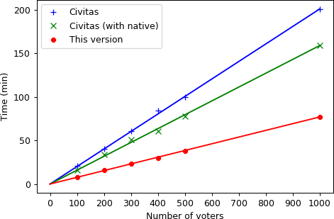

# Civitas
This repository is a part of [my](https://github.com/stubbornick) master's thesis on "Analysis and implementation of an electronic secret voting scheme".
 
## Core idea
Thesis is based on [Civitas](https://research.cs.cornell.edu/civitas/) voting system. The main idea, grossly oversimplifying it, is to move ElGamal cryptosystem from finite fields to elliptic curves, as a result more than doubling the performance in the most computationally intensive part of the voting process - the vote tallying phase:

 
## Mathematical details
My thesis has not been published yet, and if you wish to familiarise yourself with it please open an issue on GitHub, or contact me in any other way convenient for you.
 
## Usage
Refer to original Civitas [README](docs/README.civitas).
 
